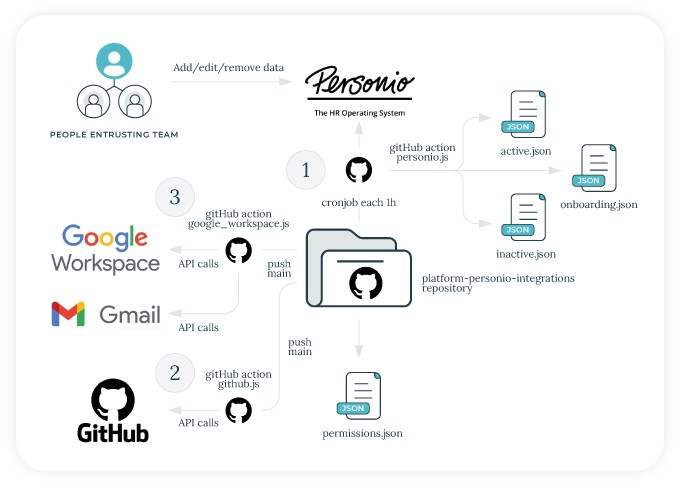

# Personio integration with GitHub & Google Workspace

The Personio integration with GitHub and Google Workspace allows you to integrate your GitHub users and teams and Google Workspace user and groups with Personio as single source of truth, to avoid manage employee information separetely on each tool.

The following diagram shows all the pieces involved in the integration:



## Prerequisites

1. Personio account. To create a new one check [Personio's website](https://www.personio.com/).
2. GitHub organization. To create a new one check [GitHub organization plans](https://github.com/organizations/plan).
3. Google Workspace plan. To create a new one check [Google Workspace site](https://workspace.google.com/).
## Getting started

Follow the steps below to get started with the Personio integration with GitHub and Google Workspace.

1. Fork this repository.

2. Install the dependencies running:

    ```sh
    npm install
    ```

3. Get Personio credentials following [these steps](https://developer.personio.de/docs#2-api-access-and-authorization). Add those credentials as `PERSONIO_CLIENT_ID` and `PERSONIO_CLIENT_SECRET` in the repository *Settings* >> *Secrets*.

4. Create custom fields on employees within Personio. Check [this article](https://support.personio.de/hc/en-us/articles/208861829-Creating-Custom-Sections-and-Attributes). You should add the following custom fields:

    - **GitHub Username**: This field will be used to link the GitHub username to the Personio employee.
    - **Distribution Lists**: This field will be used to link the Google Workspace groups to the Personio employee.
    - **Personal email**: This field will be used to send the welcome email to the company and as recovery email on Google Workspace.
    - **Job Title**: This field will be used to set the job title on Gmail signature.
    - **GitHub Teams**: This field will be used to link the GitHub teams to the Personio employee.
    - **Aliases**: This field will be used to link the Google Workspace aliases to the Personio employee.

5. Modify `personio.js` **user** object with the right dynamic fields. To check the dynamic fields use the [Personio API reference](https://developer.personio.de/reference) and make a call using Personio credentials to the `/auth` endpoint. Retrieve the token and then make a call to the `/employees` endpoint using that token. You should see the dynamic fields listed in the response.

6. Execute the script locally to check you can pull data from Personio API:

    ```sh
    node personio.js $PERSONIO_CLIENT_ID $PERSONIO_CLIENT_SECRET
    ```

7. Get a GitHub token following [these steps](https://docs.github.com/en/authentication/keeping-your-account-and-data-secure/creating-a-personal-access-token). Add the token as `GH_TOKEN` in the repository *Settings* >> *Secrets*.

8. Modify `github.js` **orgName** variable to your GitHub organization name.

9. Execute the script locally to check you can perform actions against GitHub API:

    ```sh
    node github.js $GH_TOKEN
    ```

10. Google Workspace *groups* should match with *Distribution Fields* in Personio, otherwise the script will fail. Create groups first in Google Workspace. These changes can be made by hand or using Terraform. If you are going to use Terraform, change in `terraform/main.tf` the *backend*, the *credentials* path, the *customer_id* and *impersonated_user_email* to your values to be able to authenticate against Google Workspace API. You can check the Terraform documentation [here](https://registry.terraform.io/providers/hashicorp/googleworkspace/latest/docs). Authenticate using Domain-Wide Delegation (DWD) to access the Google Workspace API.

11. Google Workspace *org_units* and *domains* should be created also in Google Workspace for *aliases*. These changes can be made by hand or using Terraform.

12. Import, add, edit or remove Google Workspace *groups*, *domains*, *org_units* and *special_users* with Terraform or by hand on [Google Workspace dashboard](admin.google.com).

13. Using the same service account generated on step 10, add the service account key as `GOOGLE_WORKSPACE_CREDS` in the repository *Settings* >> *Secrets*.

14. Get email password with https://myaccount.google.com/lesssecureapps or https://myaccount.google.com/apppasswords depending if you have 2FA enabled on the user which is going to send welcome email. Add the email and password as `MAIL_USERNAME` and `MAIL_PASSWORD` in the repository *Settings* >> *Secrets*.

15. (Optional) Change signature and welcome email html templates as you wish accordingly with your company's design system.

16. Execute the script locally to check you can perform actions against Google Workspace API:

    ```sh
    echo $GOOGLE_WORKSPACE_CREDS >> credentials.json
    node google_workspace.js $MAIL_USERNAME $MAIL_PASSWORD
    ```

17. When you verify everything is working from your local, you are able to uncomment commands in GitHub Actions so everything is performed automatically without manual intervention.

18. Change the [cronjob pattern](https://crontab.guru/) as you wish to pull data from Personio API and perform the autocommit step if there are any changes between Personio API and the employees data stored in this repository. Also you can execute the Personio GitHub Action manually. By default, the cronjob is set to run every hour.
